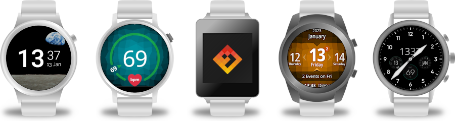

# AsteroidOS 2.0

Asteroids travel steady. Occasionally, they leave observable distance.\
It has been a while since our last release, now it's finally here!

AsteroidOS 2.0 has arrived and attracted major features and improvements along its journey through community space.
Always-on-Display, many more supported watches, new launcher styles, major performance increase in parts of the User Interface and improvements to our synchronisation clients are only some highlights of what to expect.

## Milestones reached

   * [Always-on Display](https://github.com/AsteroidOS/asteroid/issues/58)
   * [Tilt-to-wake](https://github.com/AsteroidOS/mce/pull/6)
   * [Palm-to-sleep](https://github.com/AsteroidOS/mce/pull/11)
   * [Heart rate monitor app](https://github.com/AsteroidOS/asteroid-hrm)
   * [Music volume control](https://github.com/AsteroidOS/AsteroidOSSync/pull/117)
   * [Compass support](https://github.com/AsteroidOS/asteroid-compass)
   * [Initial step counting support](https://github.com/AsteroidOS/qtsensors/pull/1)
   * [Support for Bluetooth HID and Audio](https://github.com/AsteroidOS/meta-asteroid/pull/27)
   * Base upgraded to OpenEmbedded Honister
   * Qt 5.15 upgrade

## Design, usability and app improvements

   * New UI elements  
Improved toggles, progress bars and other UI elements by unifying the design and removing inconsistencies.
   * [New App Launchers](https://github.com/AsteroidOS/asteroid-settings/pull/35)  
Four more App Launcher styles have been added. Those can be selected in the new Launcher settings page.
   * [Enhanced Wallpaper](https://github.com/AsteroidOS/asteroid-settings/pull/39) and [Watchface gallery](https://github.com/AsteroidOS/asteroid-settings/pull/40)  
Watchfaces are now paired with the user selected Wallpaper already in the Watchface gallery. Helping to find your favourite combination at a glance. Both pages received major performance improvements.
   * [Nightstand mode](https://github.com/AsteroidOS/asteroid-settings/pull/49)  
Use your watch as a bedside clock or simply show charging much more clearly. Selected watchfaces show a large charging status when power is connected. 
The nightstand settings page makes this mode very versatile. Thanks to beroset for the initial idea and implementation.
   * [Ringtone vibration pattern](https://github.com/AsteroidOS/asteroid/issues/99)  
Customise all the things! Here, the vibration pattern on incoming calls.
   * [Lag fix when multiple notifications appear](https://github.com/AsteroidOS/asteroid-launcher/pull/58)  
Successful bug hunt is always satisfying. Even more so in an area we use frequently.
   * [Calculator app with new layout](https://github.com/AsteroidOS/asteroid-calculator/pull/4)  
Improved button layout for easier operation and better legibility, especially on round displays.
   * [New wallpapers](https://github.com/AsteroidOS/asteroid-wallpapers/pull/4)  
Extending on the well received flatmesh design, triangulated wallpapers turned out to fit beautifully.
   * [Diamonds](https://github.com/AsteroidOS/asteroid-diamonds)  
A 2048 like game with a fresh twist. Suited nicely for small resolutions and displays.
   * [More translations (49 languages)](https://hosted.weblate.org/projects/asteroidos/)  
More then 20 languages added since our last release thanks to much welcome community effort.
   * [Noto Sans system font](https://github.com/notofonts)  
Supporting the localisation efforts, Noto Sans offers consistent font styles for many languages with custom character set.
   * [Color Emoji](https://github.com/AsteroidOS/meta-asteroid/pull/56)  
Underlining the flat nature of our UI, we moved from Noto Color Emoji to Twemoji.
   * [Weather app design overhaul](https://github.com/AsteroidOS/asteroid-weather/pull/12)  
Embracing the new possibilities Noto Sans and its vast variety of font styles offers. The weather app got refined towards better legibility and presentation of very long place names.
   * [Timer app redesign](https://github.com/AsteroidOS/asteroid-timer/pull/10)  
The timer app works in the background now. It got optimised for use on round watches. The design is now consistent with the stopwatch.
   * [Flashlight app](https://github.com/AsteroidOS/asteroid-flashlight)  
Yup, it flashes light. Most useful, so it got added to the stock selection.
   * [Animated Bootsplash logo](https://github.com/AsteroidOS/meta-asteroid/commit/b8f4403139cabf0ff83a663968d901c668151180)  
A very small touch. But yet another possibility for designers to get involved.

## Supported Hardware

Since 1.0 we added support for the following watches:

   * Fossil Gen 4 Watches (firefish/ray)
   * Huawei Watch (sturgeon)
   * Huawei Watch 2 (sawfish/sawshark)
   * LG Watch W7 (narwhal)
   * Moto 360 2015 (smelt)
   * MTK6580 (harmony/inharmony)
   * OPPO Watch (beluga)
   * Polar M600 (pike)   
   * Ticwatch C2+ \& C2 (skipjack)
   * Ticwatch E \& S (mooneye)   
   * Ticwatch E2 \& S2 (tunny)
   * Ticwatch Pro, Pro 2020 and LTE (catfish/catfish-ext/catshark)

These watches are in early porting stage:

   * Casio WSD-FXX series (ayu/koi)
   * Fossil Gen 5 Watches (triggerfish)
   * LG Watch Urbane 2nd edition (nemo)

Apart from adding new watches, the community has also been actively enhancing the support for our existing range of watches.
Visit our newly created [feature matrix page](https://asteroidos.org/install/features/) to find out about the detailed support level for your watch.

Despite recent minor improvements, we have decided to remove the Sony Smartwatch 3 (tetra) from our official support due to unresolved hardware [issues](https://github.com/AsteroidOS/meta-tetra-hybris/issues). Additionally, the Samsung Gear Live (sprat) is currently in an unusable state due to persistent display issues. Although the Moto 360 1st gen (minnow) has been successfully ported, it shows underwhelming performance as it is the only watch we have ported with a TI SoC. We will continue to provide install images for these watches, and we welcome new contributors with fresh ideas to help improve support. However, for the time being, we have created an Experimental category in our watch gallery for watches that we do not consider to be suitable for daily use.

## Synchronisation Clients

### [AsteroidOS Sync](https://f-droid.org/en/packages/org.asteroidos.sync/) (Android)

   * [Call detection and display](https://github.com/AsteroidOS/AsteroidOSSync/pull/110)
   * [New Bluetooth lib](https://github.com/AsteroidOS/AsteroidOSSync/pull/127) should improve stability and simplify the paring process
   * A more modular architecture, allowing for easier extending and maintainability of the app.
   * [Custom OWM API key support](https://github.com/AsteroidOS/AsteroidOSSync/pull/142)

### [Telescope](https://open-store.io/app/telescope.asteroidos) (UBports Ubuntu Touch)

After our initial release [StefWe](https://github.com/StefWe) created [Telescope](https://github.com/AsteroidOS/telescope) a sync client for UBports.

### [Gadgetbridge AsteroidOS support](https://codeberg.org/Freeyourgadget/Gadgetbridge)

Thanks to Noodlez, initial AsteroidOS support has been added to [Gadgetbridge version 0.73.0](https://codeberg.org/Freeyourgadget/Gadgetbridge/src/branch/master/CHANGELOG.md). 

### [Starship](https://openrepos.net/content/asteroidos/starship) (SailfishOS)

Enabled by recent improvements in the SailfishOS BLE stack, our community member [GeoffTearle](https://github.com/GeoffTearle) got our [client for SailfishOS](https://github.com/AsteroidOS/starfish) into a working state. 

## Infrastructure

Our website [asteroidos.org](https://asteroidos.org) has seen a major content extension. A [FAQ](https://asteroidos.org/faq/) section has been added to provide a quick overview of our project. The [Documentation](https://asteroidos.org/wiki/documentation/) pages are frequently updated by community members and nicely keep up with the current state of development.

With 2.0 we introduce a community repository, to improve discoverability and simplify the installation of precompiled packages, while building the foundation for a possible graphical software center in the future. Currently, the repository consists of a few debugging tools, {community watchfaces}, games and emulators. Developers are welcome to create pull requests on the [meta-community](https://github.com/AsteroidOS/meta-asteroid-community) repo for packaging.

The second and smaller change is the switch to Markdown as our primary markup language for documentation. This enables users without deeper knowledge to contribute to the documentation via GitHub's integrated editor. And will help us to switch the static site generator in the future.

In late March, we moved our infrastructure to a larger server. This resulted in more frequent nightly releases.

For the repository of our Android app AsteroidOS Sync, we enabled automatic builds on pull requests to catch issues with future changes early.

## Minor Changes

AsteroidOS now supports [round screens with a cut-off](https://github.com/AsteroidOS/meta-asteroid/pull/41).

PostmarketOS now offers our launcher and core apps, thanks to [PureTryOut](todo), who moved our buildsystem from qmake to cmake along the way.

MagneFire, jrt and eLtMosen joined the AsteroidOS team.

## Community

In the past years, community translators have added more than 20 languages to the [AsteroidOS Weblate](https://hosted.weblate.org/projects/asteroidos/#languages). Translating into your local language is the easiest way to get involved. Your help is most valuable to make AsteroidOS fit for use in your region.

Watchface creation has been a popular community activity lately. We are happy to present the new and comprehensive [watchfaces creation and design guide](https://asteroidos.org/wiki/watchfaces-creation/). It is garnished with testing and deployment scripts to simplify the process further. 

Our community came up with funny and beautiful new watchfaces. Here are some examples of the recent highlights:
eLtMosen has created the minimalistic [pulsedot watchface](https://www.youtube.com/watch?v=UETFXGV2dgU) and the Monty Python [silly walks watchface](https://twitter.com/eLtMosen/status/1403642123338014722). Most of his creations are available in the [unofficial-watchface repository](https://github.com/AsteroidOS/unofficial-watchfaces).

MagneFire did show-off a few emulators, Doom and [Super Tux Kart](https://fosstodon.org/@MagneFire/107105850296484856) on his watch. A 2048 port called diamonds was recently included into the stock set of apps.

Dodoradio worked on a few weird watches, like the [LG Watch W7](https://asteroidos.org/install/narwhal/) with physical hands to be taken into account. And the [Casio WSD-FXX series](https://github.com/AsteroidOS/meta-smartwatch/pull/140) with it's multifunctional secondary displays. Along with some more conventional ports such as the Fossil Gen5 and Polar M600.  
The program [lcd-tools](https://github.com/AsteroidOS/lcd-tools) by lecris and Magnefire was originally developed to control the LCD on the TicWatch Pro. And got extended by dodoradio and beroset to make use of many more features the casio secondary displays offer.

The creator of the unofficial [Subreddit](https://www.reddit.com/r/AsteroidOS/) gave us full access, making it an official channel alongside our [Mastodon account](https://fosstodon.org/@AsteroidOS).
As we already mentioned in a [previous blog post](https://asteroidos.org/news/farewell-freenode), we moved all our communication from freenode to Matrix and Libera.chat.

## The Future

As you might have noticed, the current releases linked on the installation pages have feature parity with the 2.0 release. At some point, we decided to switch from our stable 1.0 release to a quasi 1.1 nightly rolling release, as the 1.0 release became too old to maintain. In the future, we would like to change our release cycle to offer more frequent stable releases. A stable release will always be stable. But not too old to no longer be maintainable.

For the future, we are going to set up a roadmap for features we would like to see in an eventual next release.
Based on recent early community work, we might see features like:

   * Combined fitness app (Privacy minded heart rate monitoring and step counter tracking)
   * WiFi setup via the settings app
   * Web based Watchface creation tool
   * Web based flash tool
   * App store for making community contributions easily available

===================================================================================================
   * Show pictures for some relevant things
       * Tilt-to-wake
       * palm-to-sleep
       * color emoji
       * New wallpapers
       * new watchfaces
       * Telescope
